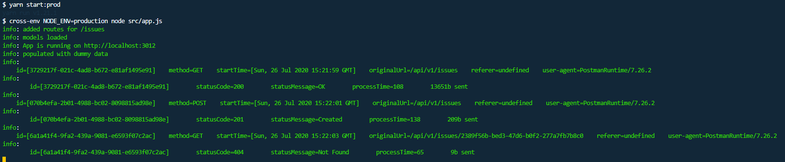

# Agile-Board-Back



This is an Api for Agile-Board Recruitment task, written in Express.

**If u are reviewer check [Notes For Reviewers](#notes-for-reviewers)**

## Table Of Contents

**[Agile-Board-Back](#agile-board-back)**

- [Agile-Board-Back](#agile-board-back)
  - [Table Of Contents](#table-of-contents)
  - [Prerequisites](#prerequisites)
  - [Installing](#installing)
  - [Running Application in development mode](#running-application-in-development-mode)
  - [Running Application in production mode](#running-application-in-production-mode)
  - [Running Tests](#running-tests)
  - [Notes For Reviewers](#notes-for-reviewers)
    - [Tech Stack](#tech-stack)
      - [Framework](#framework)
      - [Database](#database)
      - [Validation](#validation)
      - [Errors handling](#errors-handling)
      - [Logging](#logging)

## Prerequisites

- **Node**
- **npm** / **yarn**
- **postgresql**

## Installing

To install **Agile-Board-Back** use **Yarn** or **NPM**.

```
npm install
```

```
yarn install
```

## Running Application in development mode

Application started in development mode will log more sentences to console, it will also provide system notifications each time you reach error handler middleware.

To run application you need to provide database credentials check .env.example for environment variable names.

To start development server you need to type :

```
yarn start:dev
```

or

```
npm run start:dev
```

## Running Application in production mode

Application started in production mode will log less sentences to console, and it will be free of system notifications.

To start production server you need to type :

```
yarn start
```

or

```
npm run start
```

## Running Tests

To run tests you need to type :

```
yarn test
```

or

```
npm run test
```

## Notes For Reviewers

I created one endpoint to reset database, because I hosted this application and it is publicly available I cannot ensure that nobody won't change it. Please do not take into account code written there.

In agile-board.postman_collection.json you can find postman collection that can be imported into postman ;)

### Tech Stack

#### Framework

I Decided to use **Express** for this application. I build it with my custom boilerplate, so you may notice things that are redundant for recruitment task.

#### Database

As database I used **postgres**. I decided to use **ORM** just to make some things easier(auto DB tables drop for example) , so I ended up using **sequalize**.


#### Validation

To decide if request is valid I used my custom middleware based on **Joi** library.

#### Errors handling

To make logic easier to write I created StatusError Class and factory functions that returns common errors.
Error handler is simply checking if error is instance of **StatusError** and if it is it response to request with provided status **code** and **body**. Handler also contains logic to notify me via **system notifications** if there was error in the app.

#### Logging

Just to have some control on api calls I prepared logging middleware that is logging some data that I find useful :)

[Back to top](#Agile-Board-Back)
